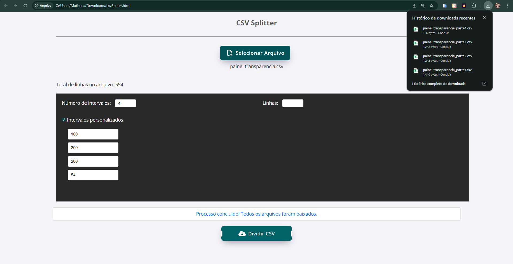

# File-Spliter

Projeto desenvolvido para solucionar um problema moroso e repetitivo da equipe de trabalho da empresa. 
A solucao automatiza o processo de divisao de bases de dados muito grandes que devem ser manipuladas com frequencia. Sendo executada localmente na m´´aquina do usuario, este sistema nao precisa de servidores externos evitando vazamento de informacoes sensiveis de clientes da empresa

